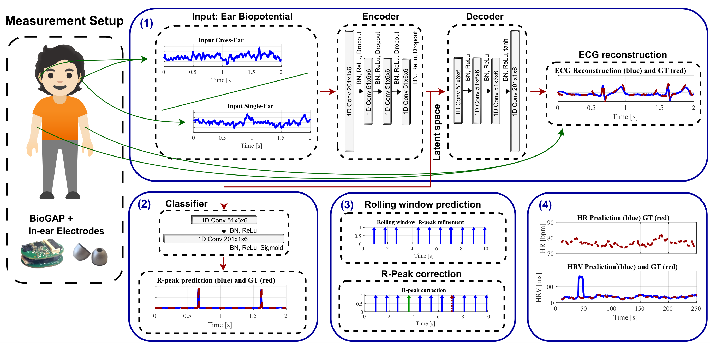

# ECG Reconstruction and R-Peak Detection from In Ear Biopotential Measurements

## Description

This is repository contains the code for our **Real-Time, Single-Ear, Wearable ECG Reconstruction, R-Peak Detection, and HR/HRV Monitoring** paper.

This project implements an algorithm based on a lightweight CNN network for real-time ECG Reconstruction and HR/HRV computation based on ear biopotentials recorded using an ear wearable (hearable).




In the current version, the code contains the logic to train the network in a LOO (leave-one-out) approach. Both leave-one-subject-out and leave-one-recording-out approaches are implemented though using different high-level scripts. Nonetheless, the logistics and functions being called are pretty much the same.

## Contents

In this repo you will find:

- High level scripts: ready to be directly run from the terminal specifying the required arguments (check the [parser.py](./parser_file.py) file). These simply offer a way to organize the output folder structure. I would recommend creating alternative files to these that still make use of the utility scripts in case a different folder structure is wanted.

    - [model_training_LOO_recording.py](./Code/model_training_LOO_recording.py): Implements end-to-end CV model training on recordings from a single subject (n-1 recordings to train and 1 recording for test).

    - [model_training_LOO_subject.py](./Code/model_training_LOO_subject.py): Similar logic to previous. Implements end-to-end CV model training now on all subjects (using all recordings from M-1 subjects to train and the final participant for test).

    - [model_cardiac_metrics_recording.py](./Code/model_cardiac_metrics_recording.py): Intented to be used after running recording LOO training. Makes use of the generated file structure to get metrics on the rolling algorithm's peak detection (precision, recall, DER) and on the HR/HRV (absolute mean errors) computation. 
    
    - [model_cardiac_metrics_subject.py](./Code/model_cardiac_metrics_subject.py): Similar logic to previous. Intended to be user after running subject LOO training.

- Utility scripts: implement the subroutines that the previous scripts call. These are truly the backbone of the project and implement the training, rolling output and inference logic. I would recommend building around/on top of these in case further functionalities are wanted.

    - [parser_file.py](./Code/parser_file.py): Specifies arguments needed to run the high-level scripts (train and algorithm evaluation).

    - [DeepMF.py](./Code/DeepMF.py): Contains the PyTorch implementation for the DeepMF DL architecture that operates at the center of the ECG reconstruction algorithm. The original implementation is based on [this paper](https://ieeexplore.ieee.org/document/10416368).

    - [data_loader.py](./Code/data_loader.py): Contains the custom PyTorch implementation for the project dataloader.

    - [train.py](./Code/train.py): Handles training the networks and saving weights and metric losses locally.

    - [inference.py](./Code/inference.py): Implements rolling output continuous DeepMF inference for real-time R-Peak detection.

    - [utils.py](./Code/utils.py): Utility functions.


Finally, the [Preprocessing](./Preprocessing) folder contains Matlab files for data preprocessing.

## How to Install

To use the code, first clone the repo via:

```bash
git clone https://github.com/pulp-bio/DeepMF-mini.git
```

## How to Use

Once the repo has been cloned, run the following command to set up the environment:

```bash
conda env create -f environment.yml
```

To activate the environment, run:

```bash
conda activate InEar_ECG
```

### Set up the Data

You have two options for preparing your dataset. Refer to [Data/Readme](./Data/Readme.md) for download instructions for both options.

#### Option 1: Use Provided Preprocessed Data

1. Download the preprocessed files.
2. Copy them into the [Data/Processed](./Data/Processed/) directory.

#### Option 2: Process the Raw Data with MATLAB

1. Store the raw .bin files in [Data/Raw](./Data/Raw/). 

2. Make use of the [data_window_processing.m](./Preprocessing/data_window_processing.m) script. This script handles recording processing and saving individually for each recording, so remember to specify `subject_id`, `recording_id`, `bin_file_name` and the recording details (`sampling frequency` and `electrode placements`). The reason this is not a fully automated script is to allow the user to mannually check the R peak detection for each subject and recording.

This will already create the intended data folder structure to interact with the Python code.

```plaintext
Processed/
├── S1/
├── .../
└── SM/
    ├── R1/
    ├── .../
    └── RN/
        ├── gt.mat/
        ├── 1.mat/
        ├── .../
        └── L.mat/
```
Where _S1_/_..._/_SM_ refer to "subject" folders that contain data for each subject. _R1_/_..._/_RN_ refer to "recording" folders that contain data for each recording for that subject. Within these folders place your .mat files (_1.mat_/_..._/_L.mat_) that contain the preprocessed 500-sample long windows of the recording, and the _gt.mat_ which must contain the ground truth chest ECG and peaks 0-1 waveforms for that entire recording. 

*Performing the Processing on your own is optional since preprocessed data from our paper is already provided.*  


### Training and inference

If everything is set up correctly, the high-level scripts should be ready to run (granted that the required inputs are passed). All high-level scripts require:

- `data_loading_dir`: str, path to the directory where the data is setup ([Data/Processed](./Data/Processed/)).
- `all_model_dir`: str, path to the directory where you want models and metrics to be stored. An example of this folder would be ([models](./models/)).
  **Note:** when creating this folder, the code expects it to contain a **Trainings.txt** file, where the specific models subfolders and features for each model are specified in consecutive lines using the format:  `folderName`: `featureName`. Beware that this `featureName` should be a valid key in the .mat files content. An example of such file is:
  ```plaintext
  # Trainings.txt
  Model 1: L_inear_f1
  Model 2: R_inear_f1
  ```
- `device`: str, the device where you want to train the model
- `model`: str, the network that you want to train. Beware that as of right now, there is only a restricted set of networks that are available as defined in the [DeepMF.py](./DeepMF.py) file.


**Examples**

To train on subject LOO using a gpu, run:

```plaintext
model_training_LOO_subject.py "/path/to/data" "/path/to/models" "device" "network_version"
```

To gather metrics on these models, run:

```plaintext
model_cardiac_metric_subject.py "/path/to/data" "/path/to/models" "device" "network_version"
```

To train our model on our data using a gpu, run:

```plaintext
model_training_LOO_subject.py "/Data/Processed" "models" "cuda:0" "DeepMFMini"
```


## License

The following files are released under the Apache License 2.0 (`Apache-2.0`) (see [Code/LICENSE](./Code/LICENSE)):

- `Code/`

The following files are released under the Apache License 2.0 (`Apache-2.0`) (see [Preprocessing/LICENSE](./Preprocessing/LICENSE)):

- `Preprocessing/`

The following files are released under the Creative Commons Attribution-NoDerivatives 4.0 International license (`CC BY-ND 4.0`) (see [Data/LICENSE](./Data/LICENSE)):

- `Data/`

The following files are released under the Creative Commons Attribution-NoDerivatives 4.0 International license (`CC BY-ND 4.0`) (see [assets/LICENSE](./assets/LICENSE)):

- `assets/`